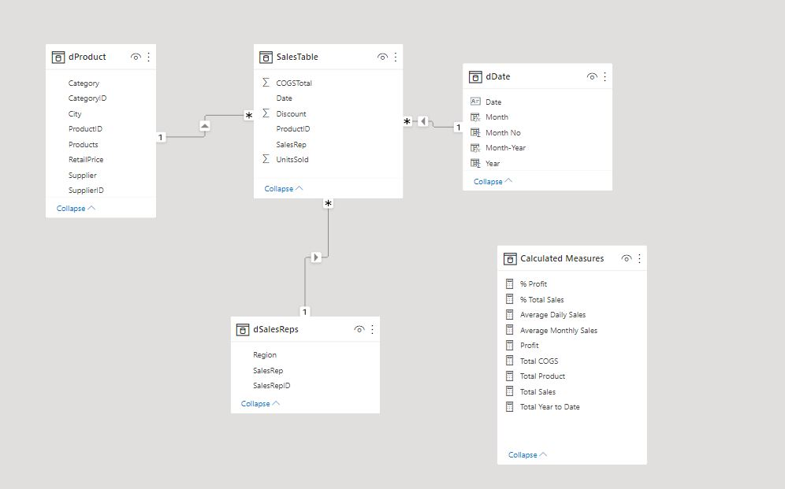
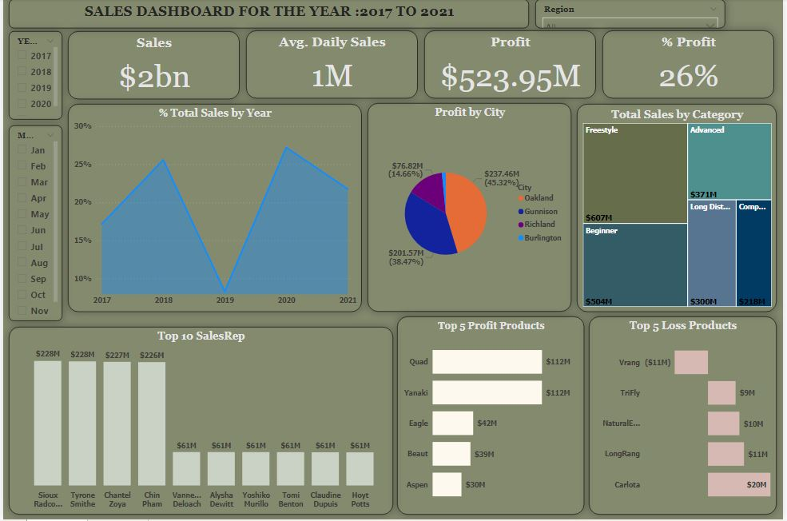

# 

# Boomerang Inc. Metrics: Sales Analysis for the year 2017 to 2018

## Introduction

I got the data online and my aim is to practice my skills of data cleaning, data modelling, data analysis, and data visualization. The major aim of this analysis is to know if there has been increase in sales and profit for the past five years.

**Power BI Concepts applied:**
- DAX Concepts:
                Calculated Table,
                Calculated Measures.
- Data Modelling: Star Schema (*:1)

----
## Problem Statement
- What is the total sales made yearly since 2017?
- What is the percentage increase in sales since 2017? As sales been increasing over the past five years.
- Which of the sales representative is more important?
- Which of the products makes the greatest profit and which of the product run the business into loss?
- Which city makes the highest profit?
## Data Sourcing
I downloaded the csv file, and extracted it into Power BI for cleaning, modeling, analysis and visualization.

It consist of three tables:
1. Sales Table with 1,406,329 rows and 6 columns.
2. Product Table with 16 rows and 8 columns.
3. Sales Reps Table with 25 rows and 3 columns.
------
## Data Transformation/Cleaning:
Data was efficiently cleaned and transformed with the Power Query Editor of Power BI. 
Some of the applied steps includes:
1. The date column in the sales table was first change to Text which was adding a new step and was later change to data by replacing the current step that was            added.
2. Another table was created which is the Data Table. dDate =  CALENDAR(DATE(YEAR(MIN(SalesTable[Date])),1,1), DATE(YEAR(MAX(SalesTable[Date])),12,31)). The Date          Table consist of 5 columns which are Date, Month, Month No, Year and Month-Year
3. Calculated measures was created to provide answers to the problem statement. The Calculated measures includes:
     - Total Sales = SUMX(SalesTable, SalesTable[UnitsSold]*(1- SalesTable[Discount])*RELATED(dProduct[RetailPrice])).
     - Total COGS = CALCULATE(SUM(SalesTable[COGSTotal]))
     - Profit = 'Calculated Measures'[Total Sales]-'Calculated Measures'[Total COGS]
     - % Total Sales = DIVIDE('Calculated Measures'[Total Sales], CALCULATE('Calculated Measures'[Total Sales],                                                                ALLSELECTED(SalesTable)))
     - % Profit = DIVIDE('Calculated Measures'[Profit], 'Calculated Measures'[Total Sales])
     - Average Daily Sales = AVERAGEX(VALUES(dDate[Date]), 'Calculated Measures'[Total Sales])

## DATA MODELLING
Power BI automatically connected related tables. The Sales table is the fact table of the model. The remaining three dimension tables; dProduct was connected to Sales table via common column Product ID, dSalesReps table was connected to Sales table via common column SalesRepID while dDate table was connected to Sales table via common column Date.

## Data Analysis and Visuals

From the analysis in the dashboard:
1. The Total Sales made in 2017 was $343M with a Profit of $78.12M, Total Sales made in 2018 was $512M with a Profit of 116.90M, Total Sales made in 2019 was $116M        with a Profit of 37.91M, Total Sales made in 2020 was $544M with a Profit of $157.92M and Total Sales made in 2021 was $435M with a Profit of $133.10M.
2. A high sales was made in Oakland city with a Total Sales of $58.79M
3. It was observed from the analysis that there was a decrease in sales in 2019 by 8% and also a decrease in 2022 by 22% and also there was a huge increment in            sales from 2019 to 2020 by 19%. 
4. **Sioux Radcoolinator, Tyrane Smithe, Chantel Zoya and Chin Pham** are the most value able sales reps for the past five years.
    
## Recommendations
    - The company needs to know the total number of products that was supplied by each supplier for each year to know why there was a drastic decrease in sales in           2019.
    - The top 5 loss products should be look into because it shows that most people don’t buy the products.
    - The company needs to sell their products to more cities not limiting to 4 cities only.
